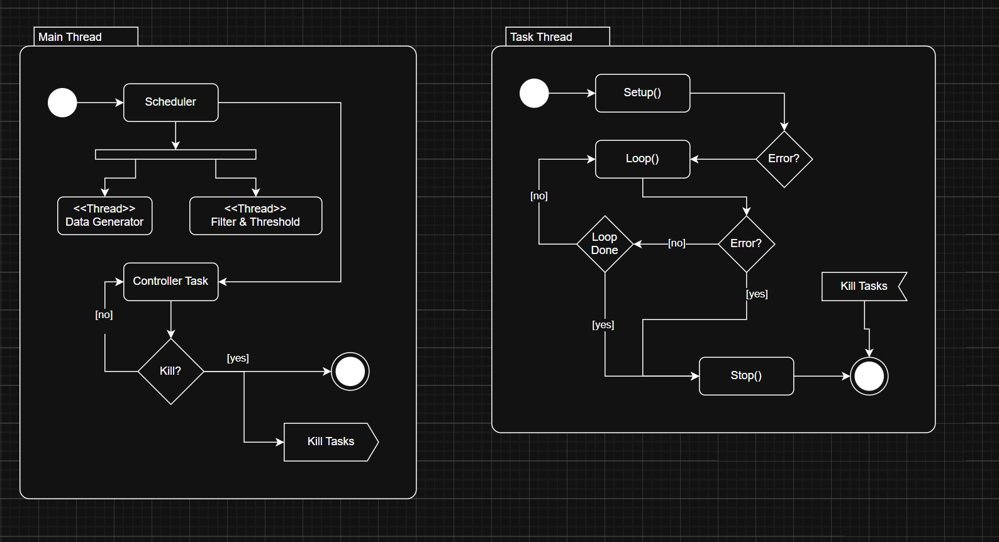

# Design overview Document

In this document I will go into more detail about the design decisions and how the product works underneath. 

In the first chapter I will explain my assumptions about the assignment. Then I will go through each main components in this product and how it relates to the two blocks of the assignment. Finally in the last chapter I will discuss why I have made certain choices over others. 

Examples given in the discussion chapter do not represent the actual code, but merely as a reference to illustrate a point made.

## Assumptions

The design decisions for this project are based on the assumption that the system will be ran on an embedded linux controller with limited memory, a processor supporting SIMD instructions and the availability of a small GPU. Due to portability of this assignment I will stick to the desktop equivalent features. 

In the assignment it became clear that this project will be the base for two other blocks later to be supported in assignment 2. I will therefor add some extra boiler plate code in anticipation for this next assignment. This makes it easier for me to make changes later. 

I have taken into account that the code is scalable where performance is not critical but still robust in places where its needed. This might reduce the total re-usability of the codebase, but in my personal experience performance critical code rarely gets or needs to be changed if written correctly. 

The system needs to be realtime where techniques which can grantee this are favored over techniques which can produce a theoretical better performance utilizing the behavior of the branch predictors on the CPU. 

## System Design

### Tasks



The overall system can be represented as a scheduler which takes up N amount of tasks. Each task runs independently and can be killed either by the scheduler or from within the task itself. 

The task handle for each task can be retrieved from the main thread or is stored by the scheduler. Here a lambda function can be give in place of the main thread. 

The main thread will become blocking once `scheduler::start()` is called. 

The Controller task should return its status back.

```c++
int main() {
    TaskA taskA;
    TaskB taskB;
    TaskC taskC;

    scheduler sched;
    auto handleA = sched.add_task(taskA);
    auto handleB = sched.add_task(taskB);
    auto handleC = sched.add_task(taskC);

    usize counter{0};

    sched.start(1'000'000'000, // poll task every 1second
        [&sched, &counter, handleB](){
        if (counter == 5){ 
            Log("Stopping TaskB from main thread");
            sched.stop_task(handleB); 
        }
        if (counter > 55u){
            Log("Stopping schedular from main thread");
            return schedular_response::stop;
        }
        Log(std::format("Main thread running iteration [{}]", counter));
        counter++;
        return schedular_response::success;
    });

    return 0;
}
```

Tasks are an abstraction over a thread where a Higher Order Functor takes in a struct and manages an internal state machine. 

```c++
auto create_task(task_like auto& task, std::stop_token token) -> void{};
```

Here each struct is required to posses the following attributes:
```c++
enum class task_error : u8 {
    failed_init, failed_exit, task_terminated
};

enum class task_response : u8 {
    yield, stop, success
};

struct task_settings {
    cstr task_name;
    time_ns deadline;
};

template <typename T>
concept task_like = requires(T t) {
    { t.setup() } -> std::same_as<std::expected<task_response, task_error>>; 
    { t.loop() } -> std::same_as<std::expected<task_response, task_error>>; 
    { t.stop() } -> std::same_as<std::expected<task_response, task_error>>;
    { t.task_settings() } -> std::convertible_to<task_settings>;
};
```

Each member function should be non blocking because the `create_task()` already has a main loop where `loop()` function is called periodically. Each function reports back it current status by returning an enum. 

### Data Pool

Each tasks communicates which each through a shared data pool. How a data bool is represented is quite flexible but need to apply to the following constraints:

```c++
enum class pool_type : u8 {
    producer_consumer_single_direction_static,
    producer_consumer_bidirectional_static,
    producer_consumer_debug_static,
    producer_consumer_profiling_static
};

template<typename T>
concept data_pool_like = requires {
    { T::type } -> std::convertible_to<pool_type>; // ex: pool_type::producer_consumer_debug_static
    { T::rx_batch_size } -> std::convertible_to<usize>; // size of producer buffer
    { T::tx_batch_size } -> std::convertible_to<usize>; // size of consumer buffer
    typename T::buffer_type; // shared_resource<resource_type::static_spsc_queue, u8, csize<32>>
    typename T::buffer_data_type; // ex: uint8_t
    typename T::flag_type; //ex std::atomic<bool>
};

template<pool_type T, typename DataType, usize RxBatchSize, usize TxBatchSize>
struct data_pool;
```

The buffer_type can be any container but ideally of types `shared_resource`. Which are a collection of pre made thread safe, lock free containers like a Single producer, single consumer queue. 

### Data Generator Task

The Data generator task is quite simple. Every time-slice `T` it will generate `N` elements using a random `xor_shift` generator and send this over a shared buffer in the `data_pool`. 

When its done it will set a flag in the `data_pool` and exit. 


### Filter & Thresholding Task

```
  Original [40]:          0   0   0   0  42  17  93   8  61  29  75  50   2  84  19  34  67  21  58  90  31  73   6  88  45  12  77  99  39  64  27  81  15  55  23  53   0   0   0   0 
  Filtered [40]:          0   0   0   0  25  35  49  35  46  46  53  41  37  49  35  42  46  43  59  62  49  50  43  57  42  45  68  68  53  53  48  52  15  55  23  53   0   0   0   0
 Treshhold [40]:          X   X   X   X   0   0   0   0   0   0   0   0   0   0   0   0   0   0   0   0   0   0   0   0   0   0   0   0   0   0   0   0   X   X   X   X   X   X   X   X

  Original [40]:         53  53  48  52  15  55  23  53  63  53  24  11 198 167 233 154 102 200 129 174  85 214 175 250  57 206 144 187 160 223 110 199 140 231 124 189 194 244  92 210 
  Filtered [40]:         53  53  48  52  37  42  39  50  51  43  42  80 150 169 180 152 147 163 147 148 145 183 183 176 140 170 162 174 175 177 156 174 170 181 163 186 194 244  92 210
 Treshhold [40]:          X   X   X   X   0   0   0   0   0   0   0   0   0   0   1   0   0   0   0   0   0   1   1   1   0   0   0   0   1   1   0   0   0   1   0   1   X   X   X   X

 ....

  Original [40]:        173 179 159 192 185 250  58 201 146 232  79 213 167 221  64 207 141 244 102 200 188 230  54 210 182 231  81 199 158 247  75 208 153 240 112 193 144 228  70 196 
  Filtered [40]:        173 179 159 192 190 179 141 172 168 172 149 182 174 166 140 173 171 181 158 186 185 170 142 184 183 175 148 177 177 178 148 179 177 183 157 173 144 228  70 196
 Treshhold [40]:          X   X   X   X   1   1   0   0   0   0   0   1   0   0   0   0   0   1   0   1   1   0   0   1   1   1   0   1   1   1   0   1   1   1   0   0   X   X   X   X

  Original [18]:        177 183 157 173 144 228  70 196  97 118 145 234 243 111   0   0   0   0 
  Filtered [18]:        177 183 157 173 167 166 134 148 122 138 170 200 173  97   0   0   0   0
 Treshhold [18]:          X   X   X   X   0   0   0   0   0   0   0   1   0   0   X   X   X   X

```
- `X` represents ignored elements

The logic of the `Data Generator Task` can be best explained using the following output and the 3 following stages:

**First batch:**

1. Initially a buffer `rx_buff` of `rx_size + window_diameter` (`window_diameter := (window_size - 1) / 2`) is constructed filled with 0. For this example a window_size of 9 will have a diameter of 4. 
2. The insertion index is set to `window_diameter` and new elements are inserted in the buffer untill `rx_size` elements have been inserted. 
3. Filtering and thresholding is applied (threshold data stored in seperate container)
4. The last `window_diameter` minus an `back_offset` are copied to the first `window_diameter` elements of `rx_buff`. 

**Normal Batch**
1. The insertion index is set to `window_diameter * 2` and `rx_size` elements are inserted again. 
2. Filtering and thresholding is applied (threshold data stored in seperate container)
3. The last `window_diameter` without `back_offset` are copied to the first `window_diameter` elements of `rx_buff`. 

**Final Batch**
1. `rx_buff` contains previous last `window_diameter` elements and insertion index represent the total remaining elements send smaller than `rx_size`. 
2. `window_diameter` padding elements are inserted at the end.
3. Filtering and thresholding is applied (threshold data stored in seperate container)

The Data Generator Task will send an event to the Filter & Thresholding task once it has no data to send any more or if it has stopped. 


## Discussion

## Task Scheduler

### Virtual threads vs regular threads

The assignment explicitly mentioned that the two Blocks (herby referred to as Tasks) needed to be ran concurrently and their execution being independent from each other. This constraint limits the use of virtual threads (`<coroutine>`) in a single thread. Virtual threads are more lightweight and have the benefit of reduced latency to switch between contexts. The main bottleneck of normal threads in regards to latency is the implicit need for synchronization methods like barriers, locks, mutexes and semaphores when exchanging data. However regular threads have more fine grained control and can be made to be equally or more performant by using lockless data structures.

Another reason for using normal threads over virtual threads was that it reduces the overhead needed to communicate with the new tasks in the future assignment as you don't need to make major modifications how tasks communicate with each other. For example if Task 3 need to also receive data from Task 1, it can simply subscribe to the same shared reader queue. Managing coordination between virtual threads in code can become more difficult and unreadable when the tasks have co-dependence. 

For these reasons it was decided to use regular threads to represent the context of a task. 

### Virtual methods vs static polymorphism

The most logical and readable way to represent a Task is to create an interface which different Task implementations can inherit from like below.
```c++
class Task {
public:
    virtual void init() = 0;
    virtual void run() = 0;
    virtual void exit() = 0
};

class Task1 : public Task {
public:
    void init() override;
    void run() override;
    void exit() override;
};

class Schedular {
// ...

private:
    std::vector<Task> tasks;
};
```

This method however is not the most performant as you are suffering a performance penalty when you are using virtual functions. Virtual functions are implemented using a `vtable` where each call to the method requires a lookup in the `vtable` to find the function address (equivalent to 1 or more pointer de-aliasing). It can also lead to stalls in branch predictions by the CPU, alongside making it harder for the compiler to perform optimizations like inlining or constant propagation. For most non-deterministic systems like GUI applications or Video games this is not much of an issue, but for high performance systems that need to be deterministic this is not an option. 

Therefor a different approach was chosen to decouple the inheritance model and use a `Higher order function` to represent a `Thread`. This is a functional programming term for a `Functor` which takes one or more `Functor-like` object. Then, it returns a function as an output:

```c++
struct Task1 {
    void init();
    void run();
    void exit();
    bool running;
};

struct Task2 {
    void init();
    void run();
    void exit();
    bool running;
};

template<typename T>
void Thread(T& task){
    task.init();
    while(task.running){
        task.run();
    }
    task.exit();
}

class Scheduler {
private:
    std::vector<std::thread> threads;

public:
    template <typename T>
    void addTask(T& task) {
        threads.emplace_back(Thread<T>, std::ref(task));
    }
// ...
};
```

This is a simplified example, but as you can see this design allows for flexibility how each task is defined (new custom methods and logic can be added) whilst still having the restriction that the Task needs to conform to three base methods. This design also does not use any virtual functions or produces indirect function calling. In many cases the compiler can even inline the calls to the methods of `Task1` or `Task2` as there any no function pointers used (`<functional>`).

This method can be made much safer at compile time using Pre-Conditions (`<concepts>`, `static_assert()`) or at run time using Post-Conditions (`<expected>`, `<optional>`, `<exception>`, `assert()`).

Because the system needs to be deterministic this method was used to represent tasks. 

## Data Representation

In the description of the assignment it was stated that the line camera was scanning an roll of a fixed width and infinite height represented as a 2D grid of columns `m` and rows `n`. Each element of the grid represents an 8bit intensity pixels where a boolean is used a meta data for each pixels to flag is a pixel is defective or not. 

### Row-major vs Column-major

Logically it would make sense to represent the data as a 2D column-major array but an 1D array with row-major order is better for latency because it accesses memory sequentially, optimizing cache usage. Column-major order accesses memory non-sequentially, causing more cache misses and higher latency. Therefor a 1D array with row-major ordering was used. 

### Array of Structs vs Structs of Arrays

The pixel data and meta data could logically be explained using a AoS structure like: 
```c++
struct pixel {
    uint8_t intensity;
    bool defective;
};

std::vector<pixel> data;
```

But using a Struct of Arrays (SoA) is better than Array of Structs (AoS) for performance because SoA allows for more efficient memory access patterns. In SoA, similar data types are stored contiguously, improving cache utilization and enabling vectorized operations, which leads to faster processing and reduced latency. So you can create a structure like:
```c++
struct pixel_data{
    std::vector<uint8_t> intensities;
    std::vector<bool> defective_mask;
}
```

Therefor a SoA was used to store all pixels and meta data. 

### Pixel Metadata. 

Due to the fact that the rows `m` are fixed, it is possible to compact the amount of storage needed for the boolean mask for the defective pixels. Multiple pixel could be represented as the bits in an `uint64_t` reducing the memory needed to store all boolean elements. This in fact is what happens by default with the `std::vector<bool>` specialization. Unlike with other data types when using a `std::vector` booleans are compacted as a bit mask and then bitwise operations are used to access individual elements. This a design choice dating back to `C++98` to reduce the memory when using booleans with containers. This is because a boolean normally is represented as an 8bit value because this is the smaller amount of memory you can allocate and define in a 64 bit architecture. 

Therefor it might seem logical to represent the defective mask as a `std::vector<bool>`. But it should be noted that element access can be significantly slower when the vector size is not divisible by a power of 2 or when the number of elements in the vector is large. This is because additional logic needs to be used to calculate which bit in which `uint64_t` of the underlying vector represent the boolean at that index. 

Another downside from an architectural and future proofing aspect of using boolean to represent the meta data, is that its not very flexible when the meta data represents a state. For example instead of only detecting defective or correct pixels, a future implementation might also need to flag pixels to ignore in a calculation. To do this only using booleans you would have to create a new vector each time you need a new state, significantly adding up the total needed memory in the application as an `std::vector` also requires some variables and data to operate. 

Therefor a better approach would be to represent the metadata as an sized enum like:
```c++
enum class pixel_meta : uint8_t{
    DEFECTIVE, CORRECT, IGNORE, //...
}; 

std::vector<pixel_meta> meta_data;
```

The benefit being that you can compare pixel states as named variables and have the guarantee that the state only used a fixed amount of memory. Another benefit is that as the application grows and you introduce more states than can be represented as an 8bit value, you can use a bigger sized data type. 

You could even use bitwise operations if you want to define a pixel that has multiple state that can be true like this:
```c++
enum class pixel_meta : uint8_t {
    DEFECTIVE = 1 << 0, // 00000001
    CORRECT   = 1 << 1, // 00000010
    IGNORE   = 1 << 2, // 00000100
    // Add more states as needed
};

// Define a pixel with multiple states
uint8_t pixel_state = static_cast<uint8_t>(pixel_meta::DEFECTIVE) | static_cast<uint8_t>(pixel_meta::IGNORE);

if (
    (pixel_state & (static_cast<uint8_t>(pixel_meta::DEFECTIVE) | static_cast<uint8_t>(pixel_meta::IGNORE)))
    == (static_cast<uint8_t>(pixel_meta::DEFECTIVE) | static_cast<uint8_t>(pixel_meta::IGNORE))
) {
    std::cout << "Pixel is both DEFECTIVE and IGNORED" << std::endl;
}
```

So for there reasons it was decided that a sized enum type was better suited to represent the pixel meta data. 

## Data Encapsulation vs External Data Class

In the assignment it was stated that data needed to be shared between different tasks in a uni-directional manner from `Task 1` to `Task 2`. It was never explicitly stated that there was a need for bi-directional data access between two or more Tasks, but this could implicitly be speculated from the two remaining tasks to be implemented in assignment 2. 

Having data tightly coupled with the logic generally is better for the latency within the same Task, as the data has a higher chance of being in a cache when instructions of a function require it. But this has the downside that its less flexible and scalable when data access patterns between one or more tasks become complex. This is because the access management needs to be done within the logic of the task, making it that you need to apply changes in multiple places of tasks for it work correctly.

Another concern is that the latency will be higher when another Task needs to access or modify the data as the function of that Task might not be closely located as the data of the other Task in memory.

Therefor it was decided to create a External Data Class with which different Tasks could share. Here the user it free to chose any data container but preferable a managed one in the `shared_resource` category.

```c++
template<typename DataType, usize RxBatchSize, usize TxBatchSize> 
struct data_pool<
    pool_type::producer_consumer_profiling_static, 
    DataType, 
    RxBatchSize, 
    TxBatchSize
>{
    static constexpr pool_type type = pool_type::producer_consumer_profiling_static;
    static constexpr usize rx_batch_size = RxBatchSize;
    static constexpr usize tx_batch_size = TxBatchSize;
    using buffer_type = shared_resource<resource_type::static_spsc_queue, DataType, csize<RxBatchSize>>;
    using buffer_data_type = DataType;
    using flag_type = std::atomic<bool>;
    
    buffer_type resource;
    
    std::vector<time_ns> tx_durations;
    std::vector<time_ns> rx_durations;

};

```

This API makes it easier in the future to change how different Tasks access the same shared data without having to modify this behavior in logic of the task itself. 