# CynLR Assignment 1

Dear reviewer, this document serves as an overview how the application can be configures and used, alongside giving an overview of the dependencies and build instructions. 

To get a better overview why certain choices where made in the project and how the project is structures refer to the document [Design Overview](./Design_Overview.md). 

The product is a `header-only` library which can in used within your project by adding it as an include_directory for your target in `CMake`

Unit tests can be found in folder `test`. Testcases can be called as individual targets or using `ctest` command line tool. 

Functional test and examples can be found in folder `examples` or refer to the `--help` arguments. Also refer to log output of functional tests in `res` folder.

There are 3 modes of operation:
1. Debug: Print out each TX and RX transaction in realtime
2. Testing: Insert csv file of supported format (see [example](./res/test_data.csv)) and show final output of each stage.
3. Profiling: Don't store results and measure duration of each TX, RX operation. Print statistics 

## Dependencies

- `CMake 3.10+`
- `Google test for MSVC` (installed by default, see [here](https://learn.microsoft.com/en-us/visualstudio/test/how-to-use-google-test-for-cpp?view=vs-2022))
- `AVX` compatible CPU
- `Ninja`
- `C++23 compatible compiler` like `msvc`

**Optional extention depencies for people using visual studio code**
- `C/C++`, `C/C++ Extetion Pack`, `CMake Tools`

## CLI commands

```
Available Commands:
--------------------
--help                 : Display help information.
--mode=<value>         : Set the mode of operation. Available values: debug, testing, profiling.
--input=<csv_file>.csv : Specify the input file. Only .csv files are allowed.
--delimiter=<char>     : Set the delimiter character (e.g., ';').
--run_time_s=<int>     : Specify the run time in seconds.
--input_columns=<int>  : Number of columns in input file.
--threshold=<u8>       : Threshold to use between [0 ... 256].

Usage:
[command] [--option=value] [...]

Examples:
[command] --help

[command] --mode=debug --run_time_s=10 --threshold=175

[command] --mode=profiling --run_time_s=10 --threshold=175

[command] --mode=testing --run_time_s=10 --threshold=175 --input_columns=32 --delimiter="," --input="file.csv"
```

## Build Instructions

### Visual Studio

1. Open project as local folder. 

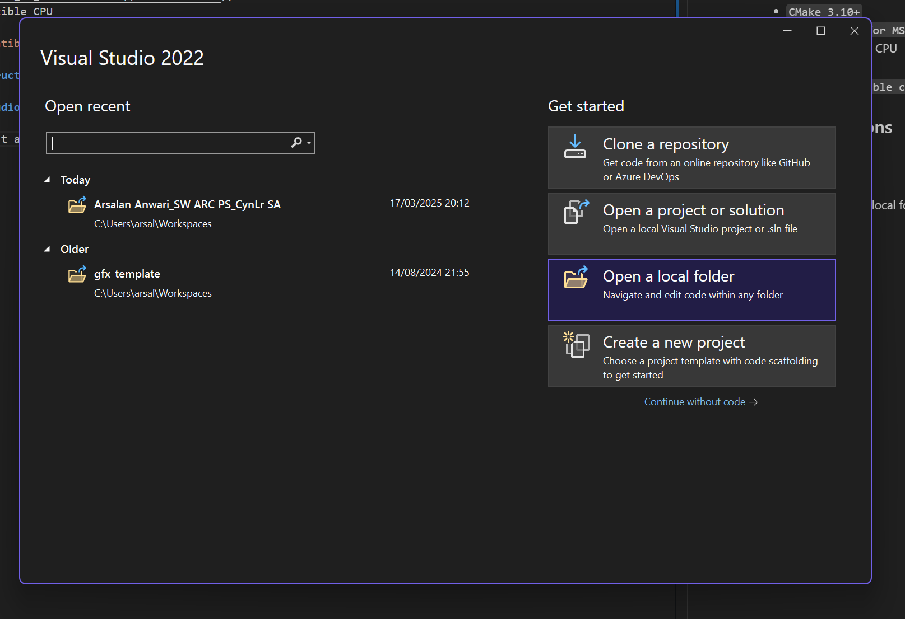

2. Delete Cache and Reconfigure Project

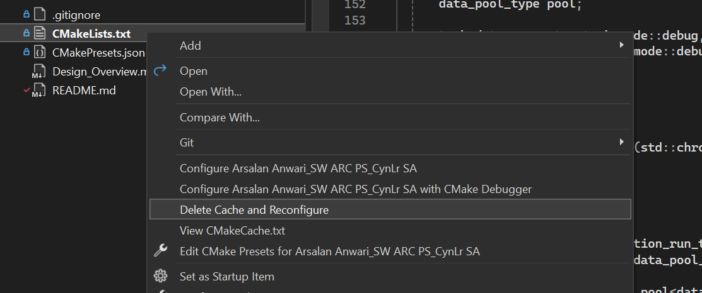

3. Switch to CMake View

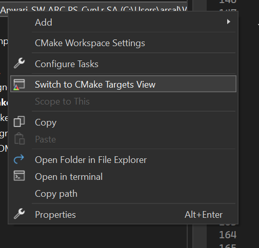

4. Build all targets or select target to build

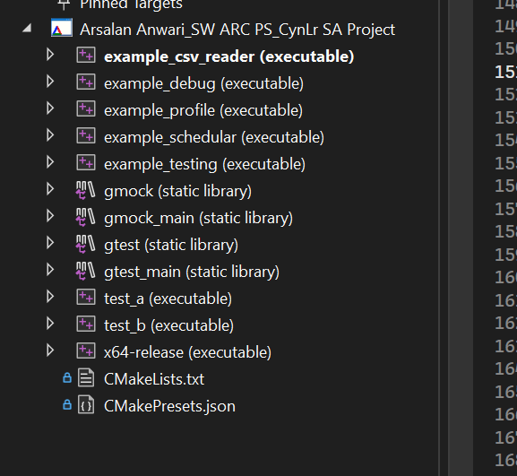

5. Run without debugger (make sure to chose `x64-release`)

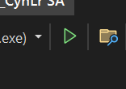


### Visual Studio Code

1. Open project as workspace using `app.code-workspace`

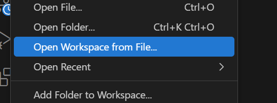

2. Go to CMake extensions panel

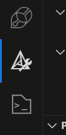

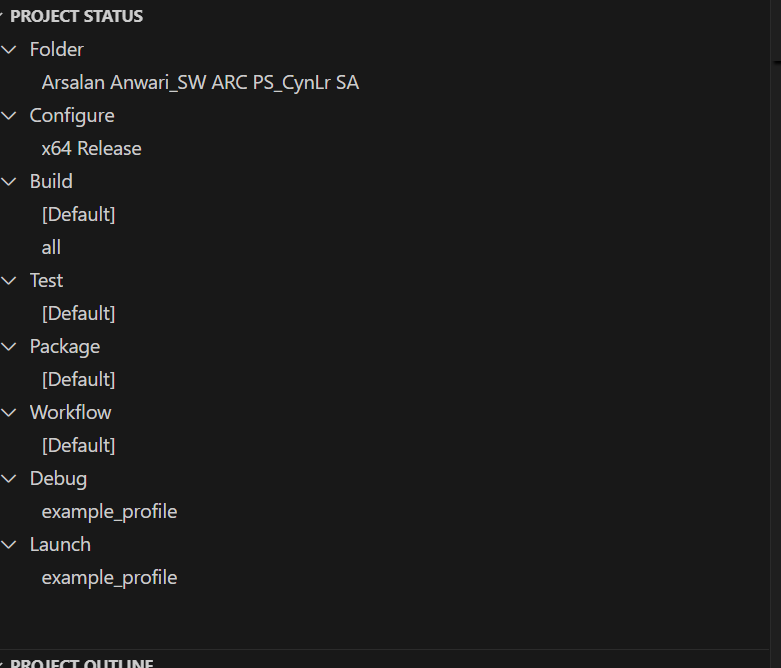

3. Select configure preset `x64 Release`

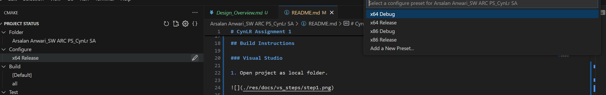

4. Select which targets to build

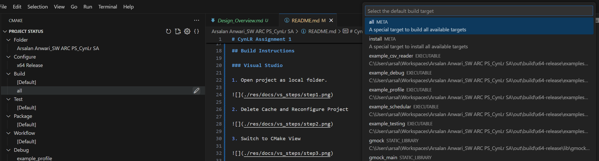

5. Select which target to launch

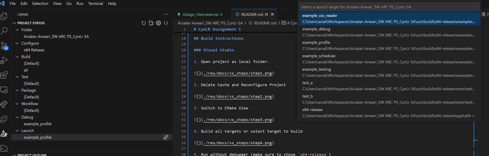

6. Build target

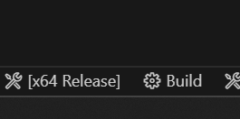

7. Launch target

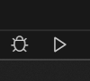